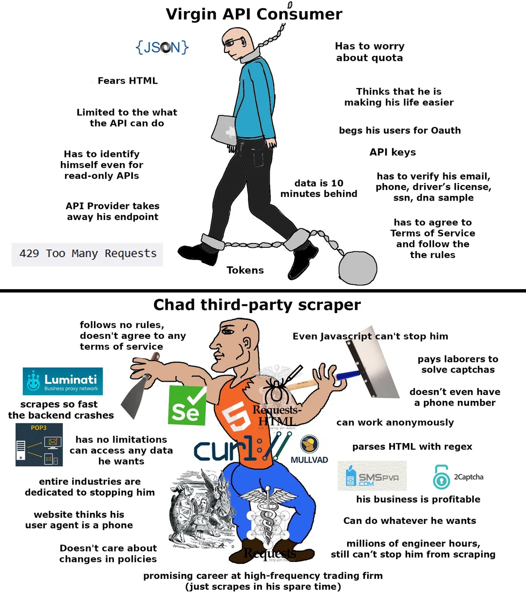

# ETH Whale Tracker

Tracks whale's transaction using etherscan API. 

### 1. Setup
```bash
git clone https://github.com/Sliden101/ETH-whale-tracker
cd ETH-whale-tracker
cp example.config.json config.json
```
#### 1.1 Config
```json
{
    "wallets": {
        "0x-1": "Wallet 1",
        "0x-2": "Wallet 2",
        "0x-3": "Wallet 3"
    },
    "api_key": "YOUR_API_KEY",
    "check_interval": 60,
    "telegram_bot_token": "YOUR_TELEGRAM_BOT_TOKEN",
    "telegram_chat_id": "YOUR_TELEGRAM_CHAT_ID"
}
```

- Get API key from [Etherscan](https://etherscan.io/apis)
- Create a [Telegram bot](https://core.telegram.org/bots/api) and obtain the bot token.


### 2. Docker

```bash
docker build -t whale-tracker .
docker run -d --name whale-tracker-container whale-tracker
```

<sub><sup>yes i know using API and not scraping boo hoo</sup></sub>


